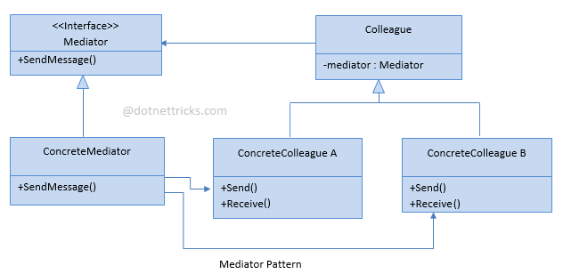

# MicroservicesKafka
Udemy course to learn microsevices with Kafka

## Application Architecture Diagram

## CQRS Pattern

CQRS stands for Command Query Responsibility Segregation. It segregates the read and write operations on a data store into queries and commands respectively. Queries perform read operations and return the DTOs without modifying any data. Commands perform writes, updates, or delete operations on the data. This distinction helps manage data access complexity in large applications by making them more decoupled and testable. Moreover, this distinction also helps to scale the read and write operations independent of each other to match skewed workloads and have separate data schemes optimized for each operation type. However, applications with simple data access requirements might not benefit from CQRS as it may add additional complexity.

## Event Sourcing 

Event sourcing is a software design pattern that is commonly combined with CQRS. Event sourcing defines an approach where all the changes that are made to an object or entity are stored as a sequence of immutable events to an event store as opposed to just storing the current state.
One of the benefits of events sourcing is that it contains a complete auditable log. In other words, all the state changes that were applied to the object or entity instead of just storing the latest or current state ss is common in traditional applications
Also, the state of an object, usually the aggregate, can be recreated by replaying the event store.
It improves performance since all events are simply appended to the event store. In other words, we never do any update or delete operations on the event store.
And finally, in the case of failure, the event store can be used to restore the entire read database.

### Event Store - Key Considerations

The event store, also known as the write database, is a database where the data is stored as a sequence of immutable events.

+ An event store must be an append only store, no update or delete operations should be allowed.
+ Each event that is saved, should represent the version or state of an aggregate at any given point in time.
+ Events should be stored in chronological order and new events should be appended to the previous event.
+ The state of the aggregate should be recreatable by replaying the event store
+ It should implement optimistic concurrency control.

## Mediator Pattern

The Mediator Pattern is a behavioral design pattern that promotes loose coupling between objects by using a mediator object to manage their interactions. It allows objects to communicate with each other without having direct references to one another, thereby reducing the dependencies between them.

In this pattern, the mediator object acts as a central hub that controls the communication between objects. Each object communicates with the mediator instead of communicating directly with other objects. The mediator then relays messages between objects as needed. This allows for a more flexible and decoupled architecture, where objects can be added, removed, or modified without affecting the other objects.

The Mediator Pattern is especially useful in complex systems where objects interact with each other in many different ways. By encapsulating the communication logic in a single mediator object, it becomes easier to manage the complexity and maintain the system over time. It also makes it easier to extend the system by adding new objects, as the mediator can be modified to handle the interactions between them.

## Repository pattern 

The repository pattern is a design pattern commonly used in object-oriented programming to manage data persistence. It is used to decouple the application logic from the data persistence layer, allowing for easier maintenance, testing, and scaling of the application.

In the context of programming, a repository is an abstraction of a data store (e.g. a database, file system, or web service) that allows the application to interact with the data without being directly coupled to the storage mechanism. The repository acts as an intermediary between the application logic and the underlying data store, providing a set of methods for creating, reading, updating, and deleting data.

The benefits of using the repository pattern include improved maintainability, testability, and scalability of the application. By separating the application logic from the data persistence layer, changes to either layer can be made without affecting the other. This allows for easier maintenance of the application, as well as improved testability, since the application logic can be tested independently of the data store.

Overall, the repository pattern is a useful design pattern that can help improve the quality and maintainability of software applications.

## How can Kafka be used with these 2 pattens?

Kafka is a distributed streaming platform that is commonly used for building real-time data pipelines and streaming applications. Kafka can be used with both the Mediator Pattern and the Repository Pattern to provide scalable and flexible communication and data storage solutions.

With the Mediator Pattern, Kafka can be used as a messaging system to enable communication between different components of a system. Each component would produce messages to Kafka, and other components would consume those messages as needed. Kafka acts as the mediator between these components, allowing them to communicate without needing to have direct references to each other. This enables a more decoupled architecture and allows for easier scaling of the system.

With the Repository Pattern, Kafka can be used as a data store for storing and retrieving data. In this use case, each component would produce messages containing data to Kafka, and a separate component would consume those messages and store the data in Kafka. This allows for a scalable and flexible data storage solution, as new components can be added to the system to consume and process the data as needed.

Overall, Kafka can be a powerful tool for implementing both the Mediator Pattern and the Repository Pattern, providing scalable and flexible solutions for communication and data storage in complex systems.

## Kafka producer

Kafka producer is used to send or produce messages to one or more Kafka topics. Kafka produces also serialize compresses and load balances data among Kafka brokers through partitioning.
A Kafka broker is a server running in a Kafka cluster, usually in the form of a container. Kafka clusters are usually made up of one or more brokers. Having multiple Kafka brokers allows for load balancing redundancy and reliable failover. 
Brokers or stateless are relying on Apache Zookeeper to manage the state of the cluster.
Apache Zookeeper is thus responsible to manage the cluster and the election of the broker leader.
It is advised to utilize a minimum of three brokers to achieve reliable fail over.
However, a single broker can handle hundreds of thousands of messages without a performance impact.

### Partition in Kafka

Topics are divided into partitions in a Kafka cluster, and partitions are replicated across brokers.
You can view a Kafka topic as a channel through which event data is streamed.
Producers always publishes or produces event messages to topics while consumers read messages from a topic that they subscribe to.
Some people like to compare a topic with a database table, while others compare to a log or a queue.

### Kafka Consumer

Kafka Consumer 
.drawio.png)

## How to build
1. First start docker and run `docker compose up -d`
2. Check containers run: `docker ps -a`
3. From src\SM-POST run `dotnet build` which will restore nuget packages and build the application.