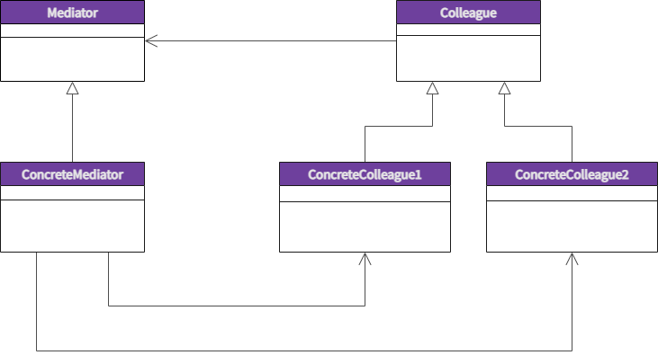

# MicroservicesKafka
Udemy course to learn microsevices with Kafka

## CQRS Pattern

CQRS stands for Command Query Responsibility Segregation. It segregates the read and write operations on a data store into queries and commands respectively. Queries perform read operations and return the DTOs without modifying any data. Commands perform writes, updates, or delete operations on the data. This distinction helps manage data access complexity in large applications by making them more decoupled and testable. Moreover, this distinction also helps to scale the read and write operations independent of each other to match skewed workloads and have separate data schemes optimized for each operation type. However, applications with simple data access requirements might not benefit from CQRS as it may add additional complexity.

## Mediator Pattern

The Mediator Pattern is a behavioral design pattern that promotes loose coupling between objects by using a mediator object to manage their interactions. It allows objects to communicate with each other without having direct references to one another, thereby reducing the dependencies between them.

In this pattern, the mediator object acts as a central hub that controls the communication between objects. Each object communicates with the mediator instead of communicating directly with other objects. The mediator then relays messages between objects as needed. This allows for a more flexible and decoupled architecture, where objects can be added, removed, or modified without affecting the other objects.

The Mediator Pattern is especially useful in complex systems where objects interact with each other in many different ways. By encapsulating the communication logic in a single mediator object, it becomes easier to manage the complexity and maintain the system over time. It also makes it easier to extend the system by adding new objects, as the mediator can be modified to handle the interactions between them.

Some common examples of the Mediator Pattern in practice include chat applications, where a chat room acts as a mediator between multiple users, and air traffic control systems, where a central controller manages the interactions between multiple aircraft.

## Repository pattern 

The repository pattern is a design pattern commonly used in object-oriented programming to manage data persistence. It is used to decouple the application logic from the data persistence layer, allowing for easier maintenance, testing, and scaling of the application.

In the context of programming, a repository is an abstraction of a data store (e.g. a database, file system, or web service) that allows the application to interact with the data without being directly coupled to the storage mechanism. The repository acts as an intermediary between the application logic and the underlying data store, providing a set of methods for creating, reading, updating, and deleting data.

The benefits of using the repository pattern include improved maintainability, testability, and scalability of the application. By separating the application logic from the data persistence layer, changes to either layer can be made without affecting the other. This allows for easier maintenance of the application, as well as improved testability, since the application logic can be tested independently of the data store.

Overall, the repository pattern is a useful design pattern that can help improve the quality and maintainability of software applications.

## How can Kafka be used with these 2 pattens?

Kafka is a distributed streaming platform that is commonly used for building real-time data pipelines and streaming applications. Kafka can be used with both the Mediator Pattern and the Repository Pattern to provide scalable and flexible communication and data storage solutions.

With the Mediator Pattern, Kafka can be used as a messaging system to enable communication between different components of a system. Each component would produce messages to Kafka, and other components would consume those messages as needed. Kafka acts as the mediator between these components, allowing them to communicate without needing to have direct references to each other. This enables a more decoupled architecture and allows for easier scaling of the system.

With the Repository Pattern, Kafka can be used as a data store for storing and retrieving data. In this use case, each component would produce messages containing data to Kafka, and a separate component would consume those messages and store the data in Kafka. This allows for a scalable and flexible data storage solution, as new components can be added to the system to consume and process the data as needed.

Overall, Kafka can be a powerful tool for implementing both the Mediator Pattern and the Repository Pattern, providing scalable and flexible solutions for communication and data storage in complex systems.

## Application Architecture Diagram

